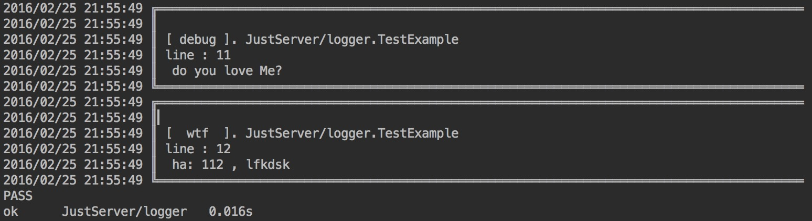

# Logger

Logger For Go

## 如何导入？  


``` go  

	import 	"github.com/lfkdsk/Logger"  
	

```


## 样式  

  


## 如何使用

### 使用Logger  

新建Logger对象：

``` go
 
	// 路径 、 模块名 、 是否启用详细信息
	log, error := New("", "module", true)
	

```

Logger中有四个等级：debug、relese、error和wtf，等级级别不断升高。

打印日志时使用：

``` go 
	
	// 支持普通string或format的格式
	log.WTF("ha: %d , %s", 112, "lfkdsk")
	log.D("do you love Me?")

```

设置最低打印等级：

``` go

	log.SetMinLevel(R_level)

```
设置后，只有这以上的等级才会打印。

保存文件：

``` go

	log.Close()

```

### 使用全局

``` go

	// 直接使用
	Global_Logger.D("ha")


```